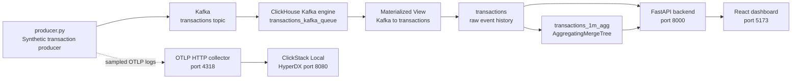

# Banking Control Tower Architecture and Dashboard Guide

## 1. Purpose

The Banking Control Tower is a real-time fintech demonstration that shows how a banking or payments operations team can move from:

```text
A transaction event
    -> live ingestion
    -> analytical aggregation
    -> anomaly detection
    -> interactive investigation
    -> merchant-level impact
```

The system uses Kafka for event transport, ClickHouse for high-volume analytical queries, FastAPI for the application API, React and Chart.js for the dashboard, and ClickStack/HyperDX for logs and observability telemetry.

The primary operational question is:

> A payment gateway is degrading right now. Can we detect the problem, identify the affected slice, find the likely cause, and inspect the merchants impacted by it?

## 2. High-Level Architecture



### Components

| Component | Role | Default endpoint or location |
| --- | --- | --- |
| `producer.py` | Generates synthetic banking transactions, publishes them to Kafka, and exposes incident controls | Kafka `localhost:9092`, control API `localhost:8001` |
| Kafka | Buffers and transports transaction events | Topic `transactions` |
| ClickHouse | Stores raw transactions, dimensions, and one-minute aggregates | HTTP `localhost:8123`, database `bank_demo` |
| ClickHouse Kafka engine | Reads events from Kafka inside ClickHouse | Internal table `transactions_kafka_queue` |
| Materialized view | Converts Kafka queue rows into the raw `transactions` table | `mv_kafka_to_transactions` |
| `transactions_1m_agg` | Stores mergeable one-minute metrics for fast dashboard windows | ClickHouse `AggregatingMergeTree` |
| FastAPI backend | Queries ClickHouse, exposes REST endpoints, and streams snapshots over WebSocket | `http://localhost:8000` |
| React frontend | Renders the executive and operations dashboard | `http://localhost:5173` |
| ClickStack Local / HyperDX | Stores and explores OpenTelemetry logs, traces, and metrics | UI `http://localhost:8080` |
| Langfuse (optional) | Traces anomaly detection, slice investigation, and ML model training | Configured with `LANGFUSE_*` environment variables |
| OTLP collector | Receives sampled producer telemetry for ClickStack | HTTP `http://localhost:4318/v1/logs` |

## 3. Transaction Data Flow

### 3.1 Event generation

`producer.py` generates a transaction with fields such as:

- Transaction, customer, account, merchant, and device identifiers
- Bank, payment rail, region, merchant category, and gateway
- Amount and currency
- Authorization status and response code
- Settlement status, fraud score, and latency
- Incident marker for events generated in the injected fault slice

The producer uses the merchant catalog to keep merchant, region, category, and gateway relationships consistent. This matters during investigation: filtering on a gateway should lead to realistic merchants and regions rather than independently randomized values.

### 3.2 Kafka ingestion

The producer publishes JSON events to the `transactions` Kafka topic. Kafka provides the streaming boundary between event generation and analytical storage.

ClickHouse consumes that topic through a Kafka engine table. A materialized view transforms each Kafka message into the typed `transactions` table. This provides a durable queryable event history while preserving the streaming ingestion model.

### 3.3 Raw and aggregate storage

The raw `transactions` table is used for:

- Anomaly detection
- Drill-down queries
- Response-code analysis
- Recent transaction listings
- Historical comparisons
- Merchant and customer impact analysis

The `transactions_1m_agg` table stores mergeable aggregate states for one-minute buckets. The dashboard uses `countMerge`, `countIfMerge`, `sumMerge`, and `avgMerge` to calculate recent KPIs and chart points without repeatedly scanning all raw events.

The `transactions_slice_1m_agg` table is a second aggregate path keyed by minute, payment rail, region, merchant category, gateway, and response code. It powers response-code and anomaly queries with `countMerge` over minute-level states. The raw table also has a time-first projection for recent event-window queries and a slice-ordered projection for the common rail/region/category/gateway drill-down, while its original dimension-first primary key remains useful for other slice filters.

The `transactions_merchant_1m_agg` table keeps the drill-down's merchant ranking on aggregate states too. The detail query ranks merchant IDs from the minute aggregate and joins the four winners to the small merchant dimension table only after `LIMIT 4`.

This split gives the demo two query modes:

```text
Fast recent summaries       -> transactions_1m_agg
Detailed investigation      -> transactions
```

## 4. Application API and Live Updates

The React application talks to the FastAPI backend on the current browser host at
port `8000` by default. Set `VITE_API_BASE` when the API is hosted separately.

### REST data endpoints

The dashboard fetches:

- `/api/status` for ClickHouse and incident status
- `/api/kpis` for the top KPI strip
- `/api/charts/timeseries` for minute-level velocity, failure, success, and latency data
- `/api/charts/gateways` for gateway failure rates and latency
- `/api/charts/rails` for payment rail mix and performance
- `/api/charts/response-codes` for authorization failure distributions
- `/api/anomalies` for slices that exceed their historical baseline
- `/api/transactions/live` for the recent transaction stream
- `/api/drilldown` for the currently selected dimensional slice

The backend serializes ClickHouse results into the TypeScript-shaped objects used by the frontend.

### WebSocket snapshots

The frontend also connects to `ws://127.0.0.1:8000/ws/live`. A snapshot can contain KPIs, chart series, gateway metrics, rail metrics, response codes, anomalies, transactions, and incident state.

When the WebSocket is unavailable, the frontend falls back to periodic REST polling. The header displays whether the current path is `LIVE` or `POLLING`.

### Refresh behavior

The header supports 1-second, 2-second, 5-second, and paused refresh intervals. Manual refresh requests the REST snapshot immediately. The WebSocket remains the preferred live path when connected.

## 5. Dashboard Overview

The dashboard is ordered from broad operational awareness to detailed investigation:

1. Header and connectivity state
2. Anomaly detection banner
3. KPI strip
4. Real-time charts
5. Gateway, rail, and response-code breakdowns
6. Dimensional drill-down explorer
7. Live transaction table

The control flow is intentional: first identify whether the system is healthy, then locate the abnormal dimension, then inspect the individual merchants and events behind it.

## 6. KPI Strip

The KPI strip is not a chart, but it establishes the operating context for every graph below it.

### Transactions and throughput

Displays the total transaction volume and transaction count for the recent 15-minute window. It also estimates transactions per second from the 15-minute count.

This answers:

- How much activity is moving through the system?
- Is the incident caused by an unusual traffic surge, or is traffic normal?

### Success rate

Displays the authorization success percentage and estimated failed transaction count. The dashboard treats 98% or higher as healthy.

A declining success rate is the primary symptom used in the incident narrative.

### Average latency

Displays the average authorization latency and an approximate p95 indicator. The dashboard highlights latency when average latency rises above its healthy threshold.

Latency should be read together with success rate. A simultaneous success-rate decline and latency increase points more strongly toward a gateway or infrastructure problem than a normal business-volume change.

### Network footprint

Displays active merchants and fraud-risk flags. These values provide scale and operational context for the transaction window.

## 7. Graphs and What They Represent

## 7.1 Transaction Velocity and Failure Volume

**Component:** `VelocityChart`

**Chart type:** Combined line and bar chart

**Data source:** `/api/charts/timeseries`, backed by `transactions_1m_agg`

### Series

- **Total Transactions:** Blue line and filled area showing total transaction count per minute
- **Failed Transactions:** Red bars showing failed transaction count per minute

### What it represents

This graph shows whether the platform is processing a steady stream of traffic and whether failures are increasing in absolute terms. It is the fastest way to distinguish these patterns:

```text
Normal volume + rising failures       -> likely service degradation
Rising volume + stable failure rate   -> likely traffic growth
Falling volume + rising failures      -> possible upstream or ingestion issue
```

The subtitle also reports the observed minimum and maximum failure rate across the displayed minute windows.

### How to read it during the demo

1. Establish the normal blue throughput pattern.
2. Inject the Gateway Y incident and let the 30-second ramp complete.
3. Watch the targeted Gateway Y slice and anomaly banner; the global failure bars may move only modestly because the incident is intentionally scoped to one rail/region/category/gateway slice.
4. Use the next chart to determine whether the failure increase is correlated with latency.

## 7.2 Authorization Success Rate and Latency Trend

**Component:** `SuccessLatencyChart`

**Chart type:** Dual-axis line chart

**Data source:** `/api/charts/timeseries`, backed by `transactions_1m_agg`

### Series

- **Success Rate:** Green line, plotted against the left axis and constrained near the 80-100% range for operational visibility
- **Average Latency:** Dashed amber line, plotted against the right axis in milliseconds

### What it represents

This graph correlates business outcome with system performance. A healthy system should show a high, relatively stable success rate and controlled latency.

A typical gateway incident appears as:

```text
Success rate  -> falls
Average latency -> rises
```

The relationship is more useful than either metric alone. A success-rate decline without latency movement may suggest business declines or authorization policy changes. A latency spike followed by infrastructure response codes suggests a technical path problem.

### How to read it during the demo

Look for the point where the green line begins to fall and the amber dashed line begins to climb. That time window becomes the starting point for comparing the incident against historical behavior.

## 7.3 Gateway Health and Failure Profile

**Component:** `GatewayHealthChart`

**Chart type:** Bar chart

**Data source:** `/api/charts/gateways`, backed by `transactions_1m_agg`

### Metric

Each bar represents a gateway's failure rate for the recent 15-minute window. The tooltip adds:

- Average latency
- Total transaction volume

Bar colors provide a quick severity signal:

- Blue: failure rate at or below 3%
- Amber: failure rate above 3% and up to 6%
- Red: failure rate above 6%

### What it represents

This graph localizes the problem to a payment gateway. It answers:

> Is the failure increase distributed across the network, or concentrated in one gateway?

A single red gateway with elevated latency is a strong candidate for the next investigation step.

### Interaction

Clicking a bar passes that gateway into the drill-down explorer. The explorer then reloads the selected slice and shows its failure rate, latency, status, and affected merchants.

## 7.4 Payment Rail Mix

**Component:** `RailDistributionChart`

**Chart type:** Doughnut chart

**Data source:** `/api/charts/rails`, backed by `transactions_1m_agg`

### Metric

Each segment represents the transaction count for a payment rail, such as:

- Card
- ACH
- Wire
- Zelle
- PayPal

The legend displays each rail's percentage of the displayed total. Tooltips add success rate and failed transaction count.

### What it represents

This graph shows the composition of payment activity. It helps answer:

- Which rail carries most of the traffic?
- Is the incident isolated to one rail?
- Is a smaller rail experiencing a disproportionate failure rate?

### Interaction

Clicking a segment selects that payment rail in the drill-down explorer. The rail selection can then be combined with region, category, gateway, and bank filters.

## 7.5 Root Cause: Response Code Breakdown

**Component:** `ResponseCodesChart`

**Chart type:** Horizontal bar chart

**Data source:** `/api/charts/response-codes`, backed by recent raw `transactions`

### Metric

Each bar represents the count of failed authorizations for a response code. Common labels include:

- `91 - System Error`
- `96 - Gateway Timeout`
- `51 - Insufficient Funds`
- `34 - Suspected Fraud`
- `05 - Do Not Honor`
- `TO - Network Timeout`
- `U30 - Gateway Switch Fail`

Infrastructure-oriented codes such as system errors and gateway timeouts are colored red. Other decline reasons are colored amber.

### What it represents

This graph moves the investigation from symptom to cause category. It distinguishes technical failures from customer, risk, or issuer declines.

For the gateway incident narrative, a large increase in codes `91`, `96`, `TO`, or `U30` is more compelling evidence of gateway degradation than an increase in `51` or `34`.

This chart is not directly clickable. Use its evidence to choose the gateway or rail to investigate in the explorer.

## 7.6 Live Transaction Stream

**Component:** `LiveTransactionsTable`

**Data source:** `/api/transactions/live`, backed by recent raw `transactions`

The table provides event-level evidence after the aggregate charts identify a problem. It displays transaction time, bank, payment rail, region, category, gateway, amount, authorization result, response code, and latency.

Use it to verify that the aggregate pattern exists in individual events. During an incident, look for repeated gateway, response-code, and latency combinations in failed rows.

## 8. Anomaly Detection Banner

The anomaly banner is the bridge between monitoring and investigation.

The backend compares a recent five-minute slice against a historical baseline for the same combination of:

```text
Payment rail + region + merchant category + gateway
```

A slice is considered anomalous when:

- It has enough traffic to avoid noisy small samples
- Its current failure rate is more than twice its baseline rate

The banner reports the current failure rate, baseline rate, and how many times above baseline the slice is running.

### Investigate action

Selecting **Investigate Slice** applies the anomaly's rail, region, category, and gateway to the drill-down explorer and scrolls to it. The bank remains independently selectable because the anomaly payload does not include a bank filter.

## 9. Drill-Down Explorer in Detail

**Component:** `DrillDownExplorer`

**Endpoint:** `/api/drilldown`

The explorer turns aggregate evidence into a specific operational slice. It maintains five filters:

```text
Bank
Payment rail
Region
Merchant category
Gateway
```

Each change sends the complete filter state to the backend. The backend runs a query against recent transaction data, applying only filters that are not `All`.

### Filter hierarchy

The intended reasoning path is:

```text
All banks
  -> one bank
  -> one payment rail
  -> one region
  -> one merchant category
  -> one gateway
  -> affected merchants
```

The filters are implemented as a composable slice rather than separate pages. This means an operator can start at any level, change one dimension, and immediately compare the result.

### Current selection

The explorer displays the active combination in this form:

```text
Bank / Payment rail / Region / Category / Gateway
```

`All` means that dimension is not restricted.

### Slice statistics

For the current selection, the explorer displays:

- **Failure rate:** failed transactions divided by total transactions
- **Average latency:** average `latency_ms` for the slice
- **Status:** `OK`, `ISSUE`, or `NO DATA`

The current UI treats a failure rate above 2.1% as an issue indicator. This is a presentation threshold for the selected slice; the anomaly banner uses the historical two-times-baseline comparison described earlier.

### Affected merchants

The bottom of the explorer lists the top merchants in the selected slice, ordered by failed transaction count. Each merchant result includes:

- Merchant name
- Transaction volume
- Failed transaction count

This is the final operational step in the default investigation path. It answers:

> Which merchants are absorbing the impact of this gateway or payment-rail problem?

### Reset behavior

**Reset All** clears every filter and returns the explorer to the overall recent transaction population. It also clears any anomaly or chart selection passed down from the parent dashboard.

## 10. Recommended Demo Sequence

1. Start the services and confirm the header reports ClickHouse connected.
2. Show the KPI strip to establish volume, success rate, latency, and network scale.
3. Use Transaction Velocity to show the live event stream and failure volume.
4. Use Success Rate and Latency to show whether degradation is technical.
5. Inspect Gateway Health to identify the gateway with concentrated failures.
6. Inspect Payment Rail Mix to determine whether the problem is rail-specific.
7. Use the response-code graph to distinguish gateway/system errors from normal declines.
8. Select the anomaly banner's investigation action, or click a gateway bar or rail segment.
9. Narrow the explorer from rail to region, category, and gateway.
10. Use the affected merchant list and live transaction table to show business impact and event-level evidence.
11. Open HyperDX separately at `http://localhost:8080` to inspect sampled producer telemetry in ClickStack.

## 11. ClickStack, HyperDX, and Langfuse Observability

ClickStack is a separate observability stack from the application ClickHouse instance. It runs in the `clickhouse/clickstack-local` container and includes HyperDX, an OpenTelemetry collector, ClickHouse storage for observability data, and its supporting services.

The producer sends one sampled transaction per 100 generated events to the OTLP HTTP endpoint. These events are exported as OTLP logs with:

- `service.name=bank-control-tower-producer`
- Bank and payment rail
- Region and merchant category
- Gateway
- Authorization status and response code
- Latency and amount
- The complete transaction event in the log body

Open HyperDX directly at:

```text
http://localhost:8080
```

The collector endpoint is:

```text
http://localhost:4318/v1/logs
```

The application dashboard and HyperDX are complementary:

```text
Dashboard -> business KPIs, anomaly detection, charts, and transaction drill-down
HyperDX   -> producer telemetry, searchable logs, and observability investigation
```

Langfuse is an optional application-level observability component. When
`LANGFUSE_PUBLIC_KEY` and `LANGFUSE_SECRET_KEY` are configured, the backend
creates spans for historical anomaly detection and interactive slice
investigation, while `ml_anomaly.py` creates a span for each model-training
run. These traces contain selected dimensions, aggregate result counts, and
model validation metrics only; raw transaction rows and customer identifiers
are not exported. This provides the trace foundation for the future **Ask the
Bank Analyst** workflow described in the demo brief, without requiring an LLM
to be deployed yet.

## 12. Startup

Start the infrastructure:

```powershell
docker compose up -d
```

Populate dimensions if required by the local data set:

```powershell
python populate_dimensions.py
```

Start the backend:

```powershell
python -m backend.main
```

Start the frontend:

```powershell
cd frontend
npm run dev
```

Start the producer:

```powershell
python producer.py --rate 2000 --api-port 8001
```

The producer retries ClickHouse startup connections and sends sampled telemetry to ClickStack by default. Sampling and the OTLP endpoint can be changed with:

```powershell
python producer.py --rate 2000 --clickstack-sample-every 100 --clickstack-endpoint http://localhost:4318/v1/logs
```

## 13. Operational Boundaries

- The dashboard's business analytics are stored in the project ClickHouse service on port `8123`.
- HyperDX's observability data is stored by ClickStack, not in the `bank_demo` application database.
- The dashboard's graphs use recent windows and aggregate tables for responsiveness.
- The drill-down explorer uses raw transaction records for detailed slices.
- The producer's ClickStack export is sampled so observability does not overwhelm the demonstration's Kafka and ClickHouse path.
- A ClickStack collector response confirms ingestion, but HyperDX may require an `otel_logs` source configuration the first time it is opened.
